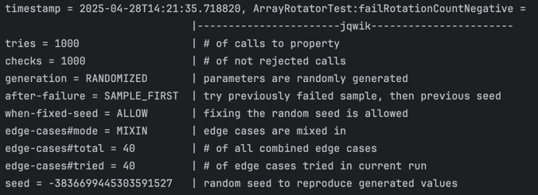
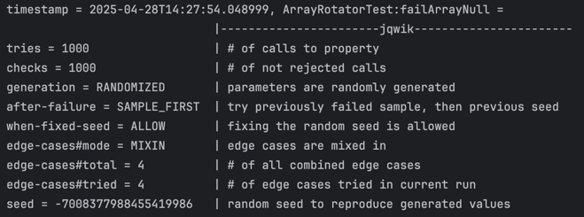
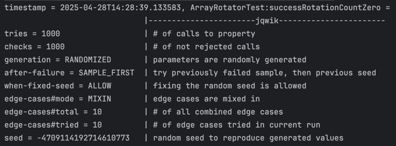

# Solution

## Task 2

<b>Pre-conditions: </b> 
- If `originalArray == null`, the function throws an `IllegalArgumentException`.
- If `rotationCount < 0`, the function throws an `IllegalArgumentException`.

<b>Post-conditions: </b> 
- If the resulting `rotatedArray` didn't rotate the elements by the correct amount, the post-condition does not hold (this doesn't need to be checked because it holds with valid inputs).

<b>Invariants: </b> 
- If the resulting array has a different length than the input array, the invariant doesn't hold (this doesn't need to be checked, since the code defines the length of `rotatedArray` explicitly as the length of the `originalArray`).

## Task 3

We implemented the following tests:

- `testRotateSuccess`: We take a standard array `{1, 2, 3, 4, 5}` and a `rotationCount` of `2` as input and expect the array `{4, 5, 1, 2, 3}` as output.
- `testRotateInputArrayNull`: We take a null array and a `rotationCount` of `2` as input and expect an `IllegalArgumentException` (Pre-condition doesn't hold).
- `testRotateRotationCountNegative`: We take a standard array `{1, 2, 3, 4, 5}` and a `rotationCount` of `-1` as input and expect an `IllegalArgumentException` (Pre-condition doesn't hold).
- `testRotateRotationCountZero`: We take a standard array `{1, 2, 3, 4, 5}` and a `rotationCount` of `0` as input and expect `{1, 2, 3, 4, 5}` as output.

## Task 1

After executing the tests from task 3, JaCoCo reports 100% line coverage in the `ArrayRotator.rotate` function.

## Task 4

The following property-based tests have been added:
- `failRotationCountNegative`: We take any randomly generated array, and a randomly generated negative `rotationCount` as input, which leads to an `IllegalArgumentException`.
- `failArrayNull`: We take a null array and any positive `rotationCount` as input, which leads to an `IllegalArgumentException`.
- `successRotationCountZero`: We take any randomly generated array, and a `randomCount` of `0` as input, which leads to the same array being returned as the input array.

## Bugs

There are no bugs in the implementation of this function.