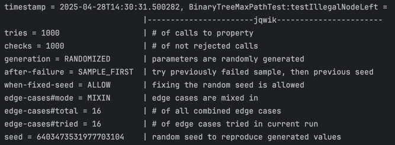
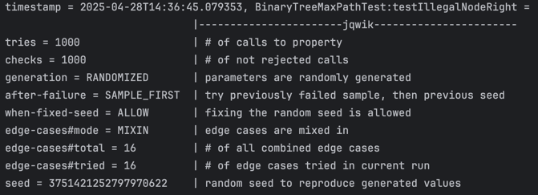

# Solution

## Task 2

<b>Pre-conditions: </b> 
- The input array can have between 0 and 1023 nodes.
- The values in the input array can be between -10^4 and 10^4.

<b>Post-conditions: </b> 
- The output should be an integer representing the maximum path length in the tree.

<b>Invariants: </b> 
- The variable `maxPathSum` always contains the currently known maximum path sum of the given tree. `maxPathSum` is 
  initialized to `Integer.MIN_VALUE`, which is the known maximum path sum at that time. In the function `maxGain`, 
  `maxPathSum` is updated when a path with a higher path sum is found.

## Task 3

We implemented the following tests:

- `testMaxPathSuccess`: We take a standard array `{1, 2, 3}` as input and expect 
  the `6` as output.
- `testMaxPathNullElementsSuccess`: We take an array with `null` elements `{-10, 9, 20, null, null, 15, 7}` as input 
  and expect `42` as output.
- `testMaxPathIllegalPositiveNodeLeft`: We take an array with the left child of the root node being larger than 
  10000 and expect an `IllegalArgumentException` to be thrown.
- `testMaxPathIllegalNegativeNodeLeft`: We take an array with the left child of the root node being smaller than
  -10000 and expect an `IllegalArgumentException` to be thrown.
- `testMaxPathIllegalPositiveNodeRight`: We take an array with the right child of the root node being larger than
  10000 and expect an `IllegalArgumentException` to be thrown.
- `testMaxPathIllegalNegativeNodeRight`: We take an array with the right child of the root node being smaller than
  -10000 and expect an `IllegalArgumentException` to be thrown.
- `testMaxPathEmptyList`: We take an empty array as input and expect `0` as output.
- `testMaxPathNullRoot`: We take an array, where the root element is `null` and expect an `IllegalArgumentException` 
  to be thrown.
- `testMaxPath1024Array`: We take an array of size 1024 as input and expect an `IllegalArgumentException` to be thrown.

## Task 1

After executing the tests from task 3, JaCoCo reports 100% line coverage in the `BinaryTreeMaxPath.maxPathSum` and 
`BinaryTreeMaxPath.maxGain` functions.

## Task 4

The following property-based tests have been added:
- `testIllegalNodeLeft`: We take an array with 3 elements, where we generate a random number that is larger than 
  10000 and a random number that is less than -10000. Then, we randomly insert either the negative illegal number or 
  the positive negative number as the left node of the root. Both should result in an `IllegalArgumentException`.
- `testIllegalNodeLeft`: We take an array with 3 elements, where we generate a random number that is larger than
  10000 and a random number that is less than -10000. Then, we randomly insert either the negative illegal number or
  the positive negative number as the right node of the root. Both should result in an `IllegalArgumentException`.

## Bugs

If the input array was left empty, the program would throw an exception in its initial state. This was fixed by 
checking whether the input array was empty, when calling the `constructTree` function. If it is empty, a tree with 
the root value set to Integer.MIN_VALUE was returned. In `maxPathSum`, we check whether `root.val` is equal to 
`Integer.MIN_VALUE`. If it is, then we know that the input array was empty, and we immediately return 0.