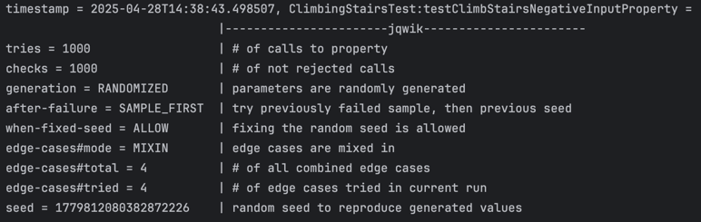

# Solution

## Task 2

<b>Pre-conditions: </b> 
- The input for `n` should be a positive integer.

<b>Post-conditions: </b> 
- The output should be an integer representing the amount of distinct ways to climb the stairs.

<b>Invariants: </b> 
- At the beginning of each loop, `oneStepBefore` holds the amount of distinct ways to climb `i - 1` stairs, while 
  `twoStepsBefore` holds the amount of distinct ways to climb `i - 2` stairs.

## Task 3

We implemented the following tests:

- `testClimbStairsBasic`: We take `10` as input and expect `89` as output.
- `testClimbStairsBorder0`: We take `0` as input and expect `0` as output (since there is no way to climb zero stairs).
- `testClimbStairsBorder1`: We take `1` as input and expect `1` as output.
- `testClimbStairsBorder2`: We take `2` as input and expect `2` as output.
- `testClimbStairsNegativeInput`: We take `-1` as input and expect an `IllegalArgumentException` to be thrown.

## Task 1

After executing the tests from task 3, JaCoCo reports 100% line coverage.

## Task 4

The following property-based tests have been added:
- `testClimbStairsNegativeInputProperty`: We take a randomly generated negative integer and expect an 
  `IllegalArgumentException` to be thrown.

## Bugs

No bugs were found in this implementation of the `ClimbingStairs.climbStairs` function.