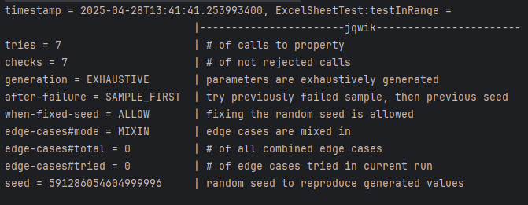

# Solution

## Task 2

<b>Pre-conditions: </b> 

- The input for `columnTitle` should be a string representing the column title in an Excel sheet.
It must hold: 1 <= `columnTitle.length` <= 7.
- The input for `columnTitle` should consist only of uppercase English letters (A-Z).

<b>Post-conditions: </b> 

- The output should be an integer representing the corresponding column number for the given Excel column title.
It must hold: 1 <= `result` <= 8353082582. The latter is the maximum value for a string consisting of 7 Z's (per the
string-length maximum from the readme).

<b>Invariants: </b> 

- The invariant inside the given for loop checks whether in each iteration the result stays within the bounds
  (1 <= `result` <= 8353082582). (In our first implemenation we checked whether it stays within the bounds of an integer,
which is not sufficient, since the result can exceed the maximum value of an integer for a string of 7 Z's. Because we changed
the type of the variable `result` to long, we don't need to check this anymore and could remove the invariant as it is
always true)

## Task 3

We needed to make the method in the `ExcelSheet` class static to be able to test them.

We implemented the following tests:

- `testExampleTitlesToNumbers`: We test the given example strings, including the minimum value "A" = 1, as well as the maximum
value "ZZZZZZZ" = 8353082582.

## Task 1

After executing the tests from task 3, JaCoCo reports 88% line coverage in the `ExcelSheet` class.
The missed lines were only in the pre-/post-condition and invariant checks, which simply throw errors.
Those lines should realistically never be reached, if the implementation is correct.

## Task 4

The following property-based tests have been added:
- `testInRange`: We take a random string of length 1 to 7, consisting of uppercase letters A-Z, and check whether the
  result is between the range 1 and 8353082582.

Jqwik output screenshot:

## Bugs

We found that for the string "ZZZZZZZ" of seven Z's, which should be the highest value and is still allowed according
to the readme, the result exceeds the maximum value of an integer. We fixed this by changing the return type of the
method and the variable result to long, which fixes the problem.