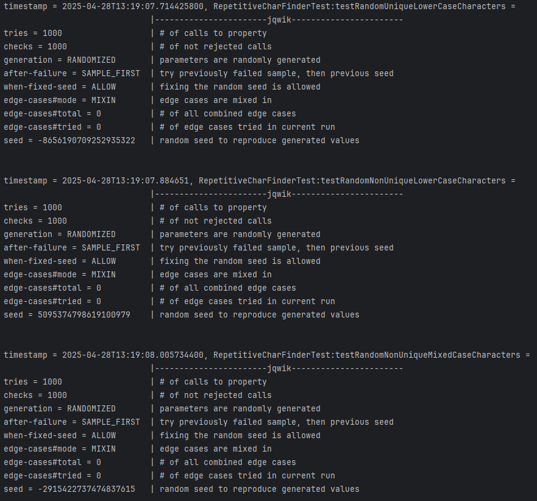

# Solution

## Task 2

<b>Pre-conditions: </b> 

- If the input is null, an `IllegalArgumentException` should be thrown.
- The input string should only contain characters from the ASCII character set.

<b>Post-conditions: </b> 

- If the input string is empty, an empty list should be returned.
- The characters in the output list should appear at least twice in the input string.

<b>Invariants: </b> 

- Before a character is added to the `nonUniqueCharacters`, it is checked whether it has already been added.
This ensures that the output doesn't contain duplicates.
- Although trivial, the character counts should always be >= 1. 

## Task 3

We implemented the following tests:

- `testExample`: We test for a happy case where the input string contains non unique characters.
- `testNoRepetitiveChars`: We test the case where the input string contains only unique characters.
- `testCaseSensitivity`: We test the case where the input string contains non unique characters but one in lowercase,
the other in uppercase.
- `testEmptyString`: We test the case where the input string is empty.
- `testNullInput`: We test the case where the input string is null.
- `testNonASCIIInput`: We test the case where the input string contains non ASCII characters.

## Task 1

After executing the tests, JaCoCo reports 86% line coverage in the `RepetitiveCharFinder` class.
The missed lines were only in the pre-/post-condition and invariant checks, which simply throw errors. 
Those lines should realistically never be reached, if the implementation is correct.

## Task 4

The following property-based tests have been added:
- `testRandomUniqueLowerCaseCharacters`: We test the case where the input string contains random strings of only unique
lowercase characters, which should always return an empty list.
- `testRandomNonUniqueLowerCaseCharacters`: We test the case where the input string contains random strings of non unique
lowercase characters, which should always return a list of the repeating non unique characters.
- `testRandomNonUniqueMixedCaseCharacters`: We test the case where the input string contains random strings of non unique
characters, but which differ in case. This should always return an empty list.

Jqwik output screenshots:

## Bugs

We found that for a null input a NullPointerException is thrown instead of an IllegalArgumentException. We fixed that by
adding the check for null in the pre-condition.
